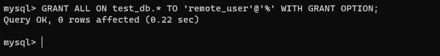

# Project 5: Client/Server Architecture Using A MySQL Relational Database Management System

Step 0:  Preparing prerequisites

- Sign in to AWS free tier account and create two new EC2 Instances of t2.nano family with Ubuntu Server 20.04 LTS or 22.04 LTS, (HVM) image.
  
- Connect to this instances via SSH on two different windows terminals renamed as;
- Server A name - `mysql-server`
- Server B name - `mysql-client`

Task:

In this project, a Client Server Architecture using MySQL Database Management System (DBMS) will be implemented.

To demonstrate a quick example of Client-Server communication in action.

Open up the Ubuntu or Windows terminal and run curl command:

 `curl -Iv www.propitixhomes.com`

 

 Step 1: Create and configure two Linux-based virtual servers (EC2 instances in AWS).

Step 2: Install MySQL Server software on the Mysql server Linux Server

`sudo apt install mysql-server -y`

Then enable the service

`sudo systemctl enable mysql`

Install Mysql client on the Linux Server on a different windows terminal

`sudo apt install mysql-client -y`

Use mysql server's local IP address to connect from mysql client. MySQL server uses TCP port 3306 by default, so you will have to open it by creating a new entry in ‘Inbound rules’ in ‘mysql server’ Security Groups

To confirm the private IP address of the Mysql-Client server, run

`ip addr show`

Edit the inbound rules for the Mysql-Server instance to run on port 3306 while giving access to only the IP address of the Mysql-Client server

Before configuring MySQL server to allow connections from remote hosts, a database and user has to be created.

start by running the security script for Mysql to validate user password

`sudo mysql_secure_installation`

Failed!
To fix this error, run

`ALTER USER 'root'@'localhost' IDENTIFIED WITH mysql_native_password by 'mynewpassword';`

error fixed by switching user rights 'root'

Type in the 'mynewpassword' for the user root to conclude the installation

Proceed to creating a user named 'remote_user'

Create a test database named 'test_db'

Grant all privileges to remote_user

Next is to flush privileges and thereafter, exit.

Now a user and a database have been created.

To configure MySQL server to allow connections from remote hosts, the configuration script will be edited by replacing the binding address ‘127.0.0.1’ to ‘0.0.0.0’.

`sudo vi /etc/mysql/mysql.conf.d/mysqld.cnf`

Replace the binding address

Restart Mysql server

Reconnect as remote_user from Mysql-Client server to Mysql on the Mysql-server running on the Linux Server

To confirm successful reconnection to remote Mysql server, run;

`Show databases;`

Exit.
